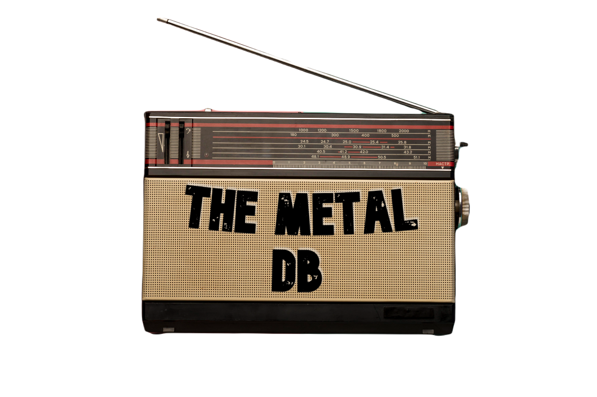
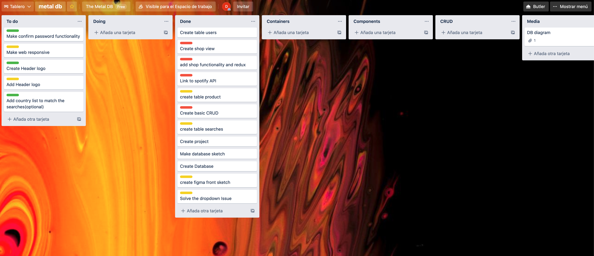
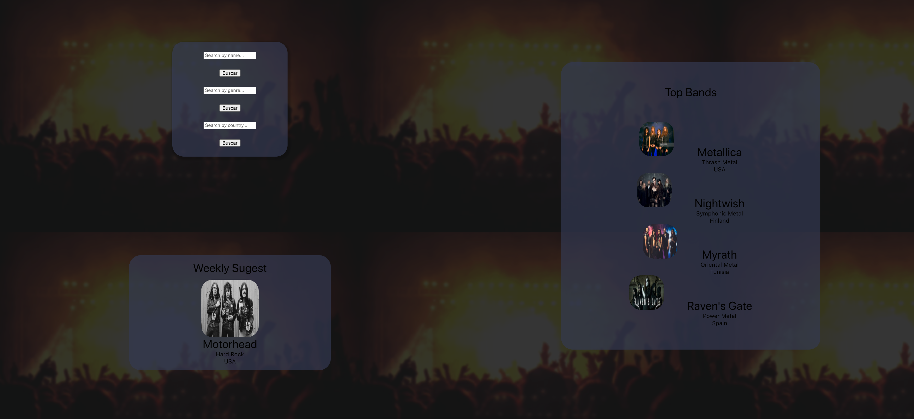

<p align="center">
  <a href="" rel="noopener">
 </a>
</p>

<h3 align="center">The Metal DB</h3>

<div align="center">

[]()
[](https://github.com/kylelobo/The-Documentation-Compendium/issues)
[](https://github.com/kylelobo/The-Documentation-Compendium/pulls)
[](/LICENSE)

</div>

---

<p align="center"> Few lines describing your project.
    <br> 
</p>

## 📝 Table of Contents

- [About](#about)
- [Getting Started](#getting_started)
- [Deployment](#deployment)
- [Usage](#usage)
- [Built Using](#built_using)
- [TODO](../TODO.md)
- [Contributing](../CONTRIBUTING.md)
- [Authors](#authors)
- [Acknowledgments](#acknowledgement)

## 🧐 About <a name = "about"></a>

This is the final project of the fullstack developer bootcamp on from Geekshubs Academy.

It's a searh engine where you can seek for bands by name, country or gender.

It has been develop over two weeks, front and back.


I have been using trello for project organization.




And the main page of the app is very straight forward. you have the searching box, the top 4 bands and a weekly sugest.



## 🏁 Getting Started <a name = "getting_started"></a>

You can fork the project here. After that, you'll need to run some commands to get you up and running.


## *cleanup* 
```
./bin/cleanup
```
To clean the environment, eliminate containers and waste. It is a good idea to do it each time before you start or to avoid problems.

## *start*

```
./bin/start
```
## *utils*

To initialize the services defined in /deploy/develop/docker-compose.yaml which is where the configuration of the entire environment is located.

```
./bin/utils <service>
```

* examples
    * ./bin/utils laravel
    * ./bin/utils react
    * ./bin/utils mysql


## *logs*

Reconnect with the output logs of the services

```
./bin/logs
```
### Installing

Once you have your dockerized enviroment running,you can do

```
npm install
```
to get all packages needed.


## 🎈 Usage <a name="usage"></a>

You can search a band by name, genre or country. If you search by country or genre it will return the list of all bands.

The shop is a work in progress.


## ⛏️ Built Using <a name = "built_using"></a>

- [React](https://es.reactjs.org/) - UI
- [Redux](https://es.redux.js.org/) - State management
- [PHP](https://www.php.net/manual/es/intro-whatis.php) - Database
- [Laravel](https://laravel.com/) - Backend framework


## ✍️ Authors <a name = "authors"></a>

- [@DanielC1492](https://github.com/DanielC1492) - Idea & Initial work

See also the list of [contributors](https://github.com/kylelobo/The-Documentation-Compendium/contributors) who participated in this project.

## 🎉 Acknowledgements <a name = "acknowledgement"></a>

- Thanks to all my classmates. This wouldn't have be possible without them